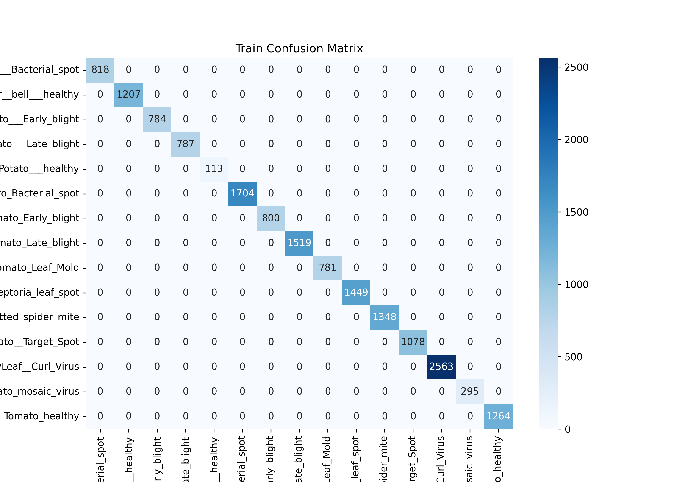
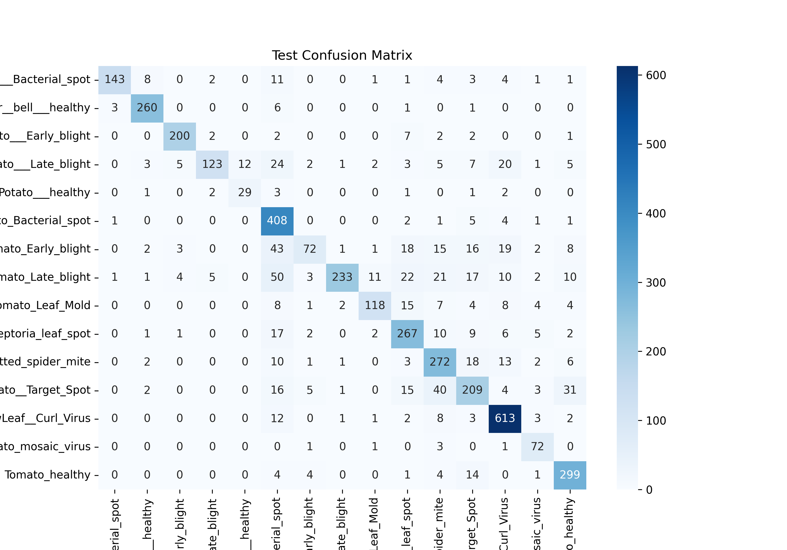
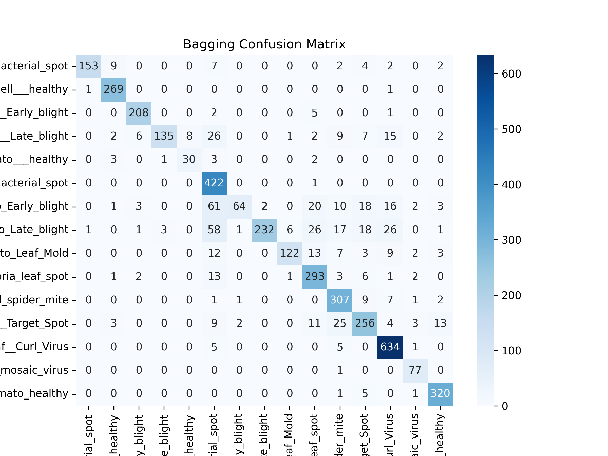

# Plant Disease Classification Project

## Project Overview

This project focuses on building a machine learning model to classify plant diseases using image data. It uses various techniques such as K-Nearest Neighbors (KNN) and Bagging for classification. The project also includes image preprocessing, feature extraction, and model evaluation using metrics such as accuracy and confusion matrices.

## Project Structure

* `data/` - Directory containing the PlantVillage dataset.
* `model/` - Directory containing the Python scripts for different models (KNN, Bagging).
* `notebooks/` - Directory for exploratory analysis and testing.
* `results/` - Directory storing model evaluation results (confusion matrices, classification reports).
* `saved_data/` - Directory for storing extracted features, labels, and trained models.
* `README.md` - This file, providing an overview of the project.

## Feature Extraction

### Color Features

* Extracted using HSV and LAB color spaces.
* For each color channel, the mean and standard deviation are calculated, providing a summary of color distribution in the image.

### Texture Features (HOG)

* Extracted using Histogram of Oriented Gradients (HOG).
* Captures the distribution of gradient directions in the image, useful for identifying textures and edges.

### Disease Features (Infected Ratio)

* Calculated using the V (Brightness) channel of the HSV color space.
* Measures the ratio of dark pixels, which may indicate infected regions.

### Deep Features (MobileNetV2)

* Extracted using a pre-trained MobileNetV2 model.
* The image is resized to 96x96, preprocessed, and fed into the model to obtain a high-level feature vector.

## Models

### K-Nearest Neighbors (KNN)

* Train Accuracy: 1.00
* Test Accuracy: 0.80
* Confusion Matrix:

  * Train:
    
  * Test:
    

### Bagging with KNN

* Train Accuracy: 1.00
* Test Accuracy: 0.85
* Confusion Matrix:

  * Train:
    
  * Test:
    

## How to Run

1. Clone this repository.
2. Install the required packages using:

   ```bash
   pip install -r requirements.txt
   ```
3. Ensure the PlantVillage dataset is placed in the `data/` directory.
4. Run the feature extraction script:

   ```bash
   python model/feature_extraction.py
   ```
5. Train and evaluate models:

   ```bash
   python model/knn_model.py
   python model/knn_bagging.py
   ```

## Results

* The models achieved high training accuracy but showed some overfitting on the test set.
* Further improvements can be made using ensemble techniques and hyperparameter tuning.
